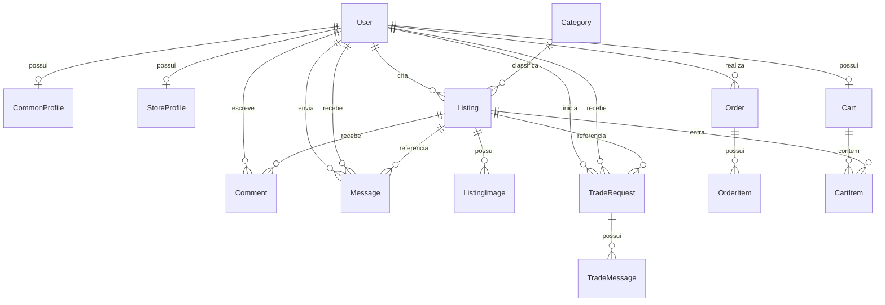

# Entidades e Relacionamentos

## Visão geral

O projeto gira em torno de seis blocos principais:

- autenticação e perfis de usuário
- catálogo de categorias
- anúncios de produto
- carrinho de compra
- comentários
- mensagens/troca futura

## Mapa das tabelas

### `User`
Usuário customizado do Django.

Campos principais:

- `username`
- `first_name`
- `last_name`
- `email`
- `password`
- `is_store`
- `profile_picture`
- `is_active`, `is_staff`, `is_superuser`

Função:

- identifica quem acessa o sistema
- define se a conta é PF ou PJ
- é o centro de relacionamento dos demais modelos

### `CommonProfile`
Perfil de pessoa física.

Campos:

- `user` (OneToOne)
- `cpf`
- `birth_date`
- `phone`
- `cep`
- `address`

Função:

- armazena dados específicos de PF
- valida CPF real

### `StoreProfile`
Perfil de loja/PJ.

Campos:

- `user` (OneToOne)
- `cnpj`
- `razao_social`
- `fantasy_name`
- `state_registration`
- `responsible_name`
- `responsible_cpf`
- `phone`
- `email`
- `commercial_cep`
- `commercial_address`
- `verified`

Função:

- armazena dados da loja
- guarda o selo de verificação
- valida CNPJ real

### `Category`
Categorias dos anúncios.

Campos:

- `name`
- `slug`

Função:

- organizar a vitrine e filtros
- facilitar busca por tipo de produto

### `Listing`
Anúncio de produto.

Campos:

- `seller` (FK para `User`)
- `category` (FK)
- `title`
- `description`
- `price`
- `listing_type`
- `condition`
- `status`
- `is_featured`
- `is_store_featured`
- `created_at`

Função:

- representa o item publicado no marketplace
- suporta venda, troca ou ambos para PF
- suporta somente venda e item novo para PJ

### `ListingImage`
Imagens do anúncio.

Campos:

- `listing` (FK)
- `image`

Função:

- permite múltiplas imagens por anúncio

### `Comment`
Comentários do anúncio.

Campos:

- `listing` (FK)
- `user` (FK)
- `content`
- `created_at`

Função:

- tirar dúvidas antes da compra ou troca

### `Cart`
Carrinho do usuário.

Campos:

- `user` (OneToOne)
- `created_at`

Função:

- agrupar itens de compra do usuário logado

### `CartItem`
Item dentro do carrinho.

Campos:

- `cart` (FK)
- `listing` (FK)
- `desired_action`
- `added_at`

Função:

- relaciona um anúncio ao carrinho
- evita duplicidade com `unique_together`
- permite separar compra e troca

### `Order`
Pedido criado a partir do checkout.

Campos:

- `buyer` (FK)
- `payment_method`
- `delivery_method`
- `status`
- `total_amount`
- `notes`
- `created_at`
- `updated_at`

Função:

- registrar a compra enquanto a confirmação de pagamento é integrada depois

### `OrderItem`
Item salvo dentro do pedido.

Campos:

- `order` (FK)
- `listing` (FK)
- `seller` (FK)
- `title_snapshot`
- `unit_price_snapshot`
- `quantity`

Função:

- manter um histórico do que foi comprado naquele pedido

### `Message`
Mensagem entre usuários.

Campos:

- `sender` (FK)
- `receiver` (FK)
- `listing` (FK)
- `content`
- `created_at`

Função:

- base para chat futuro da negociação de troca
- hoje ainda não está integrado ao fluxo principal

### `TradeRequest`
Solicitação formal de troca.

Campos:

- `requester` (FK)
- `counterparty` (FK)
- `listing` (FK)
- `status`
- `initial_message`
- `created_at`
- `updated_at`

Função:

- organizar a negociação de troca separada da compra
- registrar o status do acordo

### `TradeMessage`
Mensagem associada a uma solicitação de troca.

Campos:

- `trade_request` (FK)
- `sender` (FK)
- `content`
- `created_at`

Função:

- manter o histórico da conversa da troca

## Relacionamentos

## Observação importante

Hoje o projeto ainda mistura um pouco a lógica de compra e troca no mesmo anúncio. A direção mais limpa é tratar a compra pelo carrinho e a troca por uma entidade própria de negociação, em vez de tentar resolver tudo dentro do mesmo fluxo.
