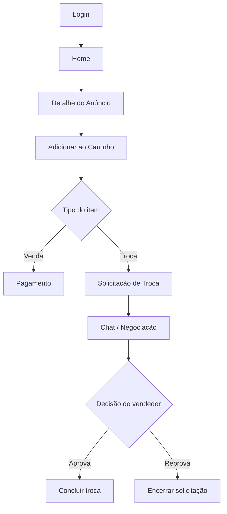

# Fluxos Do Sistema

## 1. Autenticação

### Login

- o usuário informa `username` e `password`
- o backend autentica com `authenticate`
- se der certo, a sessão é criada
- existe opção de lembrar a sessão por mais tempo

### Cadastro

O cadastro é dividido em dois tipos:

- Pessoa física
- Loja/PJ

Regras:

- PF exige CPF válido e dados pessoais
- PJ exige CNPJ válido e dados de empresa
- loja recebe `is_store=True`
- conta de loja nasce sem verificação (`verified=False`)

## 2. Publicação de anúncios

### Pessoa física

Pode publicar:

- venda
- troca
- venda e troca

Pode publicar:

- produto novo
- produto usado

### Loja/PJ

Pode publicar somente:

- venda

E somente:

- produto novo

Regra de negócio:

- se a conta for loja, o sistema bloqueia anúncio de troca
- se a conta for loja, o sistema bloqueia anúncio usado

## 3. Home

A home exibe:

- produtos recentes
- destaques
- lista geral de anúncios ativos
- filtro por categoria
- busca por texto

Fluxo desejado:

- usuário procura por palavra-chave
- sistema filtra título, descrição e categoria
- usuário escolhe um card e abre o detalhe

## 4. Detalhe do anúncio

No detalhe o usuário vê:

- imagem
- preço
- categoria
- condição
- tipo de anúncio
- vendedor
- comentários

Ações disponíveis:

- ver detalhes
- comentar
- adicionar ao carrinho

## 5. Carrinho e compra

Fluxo recomendado para venda:

1. usuário adiciona itens ao carrinho
2. sistema separa itens de venda e itens de troca
3. o usuário finaliza a compra dos itens de venda
4. o sistema encaminha os itens de troca para uma fila de negociação

## 6. Troca

A troca não deveria seguir o mesmo fluxo de pagamento.

O desenho mais simples e inteligente é este:

- ao finalizar o carrinho, itens marcados como troca viram solicitações de negociação
- o sistema cria uma conversa ou pedido de troca ligado ao anúncio e aos usuários envolvidos
- o vendedor pode aceitar, recusar ou pedir mais informações
- se houver mais de um anúncio/mais de um dono, o sistema cria uma negociação por relação necessária

### Status sugeridos para troca

- `pending` ou `aguardando`
- `negotiating` ou `em_negociacao`
- `approved` ou `aprovada`
- `rejected` ou `reprovada`
- `completed` ou `concluida`
- `cancelled` ou `cancelada`

### Recomendação prática

Para o MVP, eu sugiro estes 4 status:

- `aguardando`
- `em_negociacao`
- `aprovada`
- `reprovada`

Depois, quando a base estiver estável, acrescentar `concluida` e `cancelada`.

## 7. Chat

A troca deveria usar chat próprio.

Sugestão de fluxo:

- a troca cria uma solicitação
- essa solicitação abre uma conversa entre comprador e vendedor
- as mensagens ficam ligadas ao anúncio e à solicitação
- o chat serve para negociar preço, itens e condições

## Diagrama do fluxo principal

